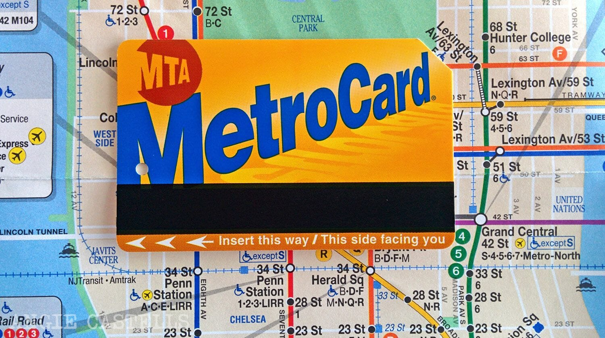

# RETO SEMANA 1 #
## CONCEPTOS CLAVE DE AZURE : 
- Compute Services:

  Es la categoria proporciona servicos de computo o procesamiento para ejecutar aplicaciones basadas en la nube

- Networking Services:
  
  Proveen de funciones de red a los servicios de Azure y permiten conectarse con el mundo exterior o entre si, encontraras Redes virtuales o DDos protection y más

Puedes encontrar más en el siguiente enlace <https://web.microsoftstream.com/video/f34ea46e-998b-49b0-850b-41bf1a83f337>

## Regiones Azure ##
No debes de olvidar que Azure tiene servicio en solo _5 regiónes_ que son un área geográfica del planeta que contiene al menos un centro de datos, aunque podrían ser varios centros de datos cercanos y conectados mediante una red de baja latencia. Azure asigna y controla los recursos de forma inteligente dentro de cada región para garantizar que las cargas de trabajo están bien compensadas.

Al implementar un recurso en Azure, es habitual tener que elegir la región en la que quiere que se implemente el recurso.
De esa forma puede optimizar el tiempo por uso el tiempo de respuesta debido al recorrido fisico de los datos.

Tambinen existen las *_zonas de disponibilidad_* son centros de datos separados físicamente dentro de una región de Azure. Cada zona de disponibilidad consta de uno o varios centros de datos equipados con alimentación, refrigeración y redes independientes. Una zona de disponibilidad se configura para constituir un límite de aislamiento. Si una zona deja de funcionar, la otra continúa trabajando. Las zonas de disponibilidad están conectadas a través de redes de fibra óptica de alta velocidad privadas.

En este enlace puedes checar más al respecto de la compatibilidad de regiones.
<https://docs.microsoft.com/es-es/azure/availability-zones/az-region>

Las geografias dentro de Azure son

- Americas
- Europa
- Asia pacifico
- Oriente medio
- Africa

## Conceptos
- IaaS:
  
  Significa Infrastructure As A Service
  
  Aqui se crea una infraestructura de pago por uso alquilando servidores, maquinas virtuales, almacenamiento, redes y sistemas operativos de un provedor en la nube. Aquí usted basicamente tiene que hacer todo a excepción de pequeños puntos en la recta como un render o tiempo en la nube por distancia.

- PaaS:
  
  Significa Plataform As A Service

  Serive para construir, crear o aprobar aplicaciones de software, basicamente ayuda a crear aplicaciones rapidamente sin centrarse en la gestion de la infraestructura adyacente. Aqui usted se preocupa por administrar la aplicación y las bases de datos de esta.
- SaaS:
  
  Significa Software As A Service

  Este software es habitualmente usado por usuarios finales, los usuarios usan aplicaciones basadas en la nube como lo es office 365. Usted aqui solo se preocupa por usar la aplicación.

## Conceptos un poco más importantes
- La informatica en la nube
  
  Es la prestación de servicios informaticos a través de internet mediante un modelo de precios de pago por uso.

- Capex:

  Significa Capital Expenditure que consiste en gastar en infraestructura fisica por adelantado para deducir el gasto en la factura de impuestos, que tiene un alto costo inicial y el valor se reduce con el tiempo.

- OpEx:

  
  Significa Operational Expenditure y es gastar en productos o servicios según sea necesario recibiendo una factura inicial.

## Tipos de nube

- Nube Pública:
  
  Los recursos de nube los servidores y el almacenamiento son propiedad de un provedor de servicios de tercero que los explota y los distribuye por internet.

- Nube Privada:
  
  Aqui las organizaciones crean su entorno de nube en su propio centro de datos.

- Nube Híbrida:
  
  Esta es la combinación de ambos tipos de nube para permitir que las aplicaciónes se ejecuten de manera adecuada.
  
### Ventajas de la nube (al menos de Azure)
- _Alta disponibilidad_: en función del contrato de nivel de servicio (SLA) que elija, las aplicaciones basadas en la nube pueden proporcionar una experiencia de usuario continua sin tiempo de inactividad perceptible, aunque se produzcan errores.
- _Escalabilidad_: las aplicaciones en la nube se pueden escalar verticalmente y horizontalmente:
  
  - Escale verticalmente para aumentar la capacidad de proceso mediante la incorporación de RAM o CPU adicionales a una máquina virtual.
  - El escalado horizontal aumenta la capacidad de proceso mediante la adición de instancias de recursos, como la incorporación de máquinas virtuales a la configuración.

- _Elasticidad_: puede configurar aplicaciones basadas en la nube para aprovechar el escalado automático, de forma que las aplicaciones siempre dispondrán de los recursos que necesitan.  

- _Agilidad_: implemente y configure rápidamente los recursos basados en la nube a medida que cambian los requisitos de la aplicación.

- _Distribución_ geográfica: puede implementar aplicaciones y datos en centros de datos regionales de todo el mundo, lo que garantiza que sus clientes siempre tendrán el mejor rendimiento de su región.
- _Recuperación ante desastres_: al usar los servicios de copia de seguridad basados en la nube, la replicación de datos y la distribución geográfica, podrá implementar las aplicaciones con la seguridad de saber que los datos están protegidos en caso de que se produzca un desastre.

 
